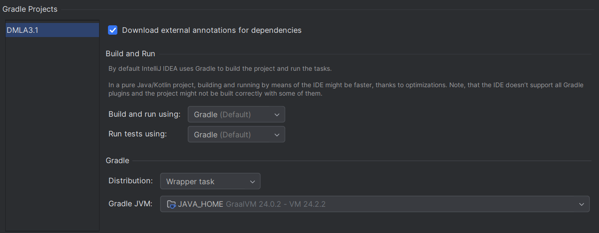

# Getting started with the DMLA3.1 project
WIP
This guide summarizes the procedure of importing/building the DMLA Kotlin project.

The guide assumes the use of IntelliJ IDEA, but the project may be developed/built with a different IDE as well.

## Prerequisites and import

* GraalVM 24 is required (but it can be installed within IntelliJ IDEA, and for the most part things work even if JAVA_HOME is not set to GraalVM).
* Use the setting shown in Fig. 1 or ensure that Gradle 9.0.0 is installed within IntelliJ or globally with a compatible JDK version in PATH
<figure markdown>
  
  <figcaption>Fig 1: Recommended Gradle Settings (when a local Gradle 9 installation is not available)</figcaption>
</figure>

!!! note "On *Unable to delete...* errors"
    Gradle sometimes fails due to not being able to delete certain jar files. If you are using the wrapper task, installing Gradle natively resolved this problem in multiple times. Issuing the command `gradle --stop` may also fix the issue when a dead Gradle daemon keeps the file locked/open.

The project was last refactored using IntelliJ IDEA 2025.2, earlier versions may have _(even more)_ issues with Kotlin KSP. I recommend the [JetBrains Toolbox App](https://www.jetbrains.com/toolbox-app/) for updating IDEA to the latest version without a hassle.

The Gradle project should take care of any additional requirements (including building the Dokka plugin).
The first import of the Gradle project takes a _tremendous_ amount of time, taking up to 4 minutes even on a system with an Intel i7 13700K (16c/24t) and 64 GBs of RAM.

When the import completes, build the project with the IntelliJ build button (or by invoking the DMLA3.1:build Gradle task). As a side effect, the first build runs the KAPT and KSP generators, therefore all generated symbols will become availble in code completions and analyzers.

Once the build completes, the *LSP* and *Launcher* launch configs should work as expected.

### Dependency management

In an effort to unify and simplify the management of our Gradle dependencies, the project has been refactored to use [Gradle version catalogs](https://docs.gradle.org/current/userguide/version_catalogs.html).

I found the [Android Studio migration guide](https://developer.android.com/build/migrate-to-catalogs) to be one of the most straightforward introductions to Gradle version catalogs.

In further releases we should avoid version specification in `*.kts` files even as variables, as the *libs* object makes all items set in the libs.versions.toml file available in all sub-project configurations.

## Additional remarks
`org.dmla` package prefixes will be added using Gradle later on, it is safe to ignore all related warnings.
The JVM target was set to 24, but further testing is required to validate that this did not break anything.

**The ANTLR rutime dependency is required due to an error in Truffle DSL that selects a wrong ANTLR version as its dependency, and fails to process the KAPT-generated code. DO NOT REMOVE IT.**
