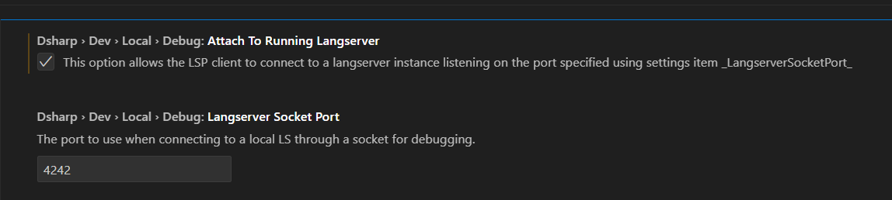

# Visual Studio Code Extension Development

The D# VS Code extension is available in the [DMLAVSCodeExtension](https://github.com/dmlaorg/DMLAVSCodeExtension) repository.

## Prerequisites
To develop and build the VS Code extension a fairly recent version of NodeJS is required, and the use of VS Code is strongly recommended.

To get started with building and debugging the extension, run `npm i` in the root directory of the extension.

With all dependencies installed, the VS Code debugger functions as expected, and a development instance can be started with `F5`. TypeScript debugging should work as expected, and at this stage, all warnings are safe to ignore. 

**When the VS Code instance displays a popup indicating that there are errors but provides the option to start debugging anyway, it is safe to continue debugging.**

## Debugging the language server

The default configuration allocates a random free TCP port, and uses the DMLA Launcher to start the language server. When debugging the LS, you might want to connect to an instance already running (most likely with a debugger attached) using a specific TCP port. To do so, in the VS Code instance running the extension open D# settings, and enable the `Attach To Running Langserver` option, and ensure that the `Langserver Socket Port` item is set to the correct port. The default port the LS will start listening on is `4242`.

<figure markdown>
  
  <figcaption>Fig 1: VS Code LS debug settings</figcaption>
</figure>

*An option that instructs the langserver to wait for a remote JVM debugger to be attached is under consideration, as the shipped releases should not expose such functionality.*